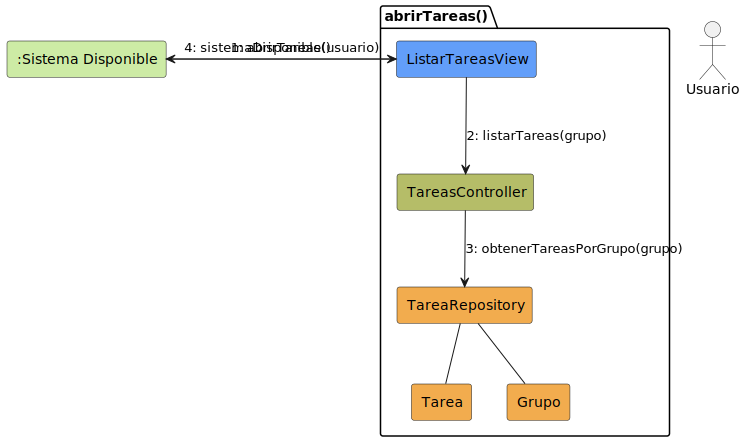
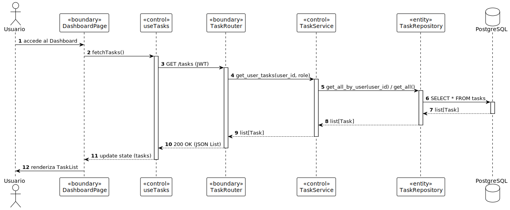

# Diseño Técnico: Caso de Uso - abrirTareas

> | [🏠 Inicio](/README.md) | [🏗️ Análisis](/RUP/01-analisis/casos-uso/abrirTareas/README.md) | [🎨 Diseño](/RUP/02-diseño) | [💻 Desarrollo](/frontend/src) |

---

## 1. Diagrama de Colaboración (Análisis RUP)

A nivel de análisis conceptual (BCE), el diagrama de comunicación en formato de grafo modela las interacciones iniciales agnósticas a la tecnología.



* [Código fuente PlantUML (.puml)](../../../01-analisis/casos-uso/abrirTareas/colaboracion.puml)

---

## 2. Diagrama de Secuencia (Diseño MVC)

A nivel de diseño físico, la realización técnica detalla el flujo de mensajes asíncronos y la orquestación a través del controlador, el servicio y el repositorio.



* [Código fuente PlantUML (.puml)](./secuencia.puml)

---

## 3. Especificación del Contrato de API (Endpoint)

Para listar todas las tareas pertenecientes al grupo del usuario actual.

- **Endpoint:** `GET /api/v1/tareas`
- **Content-Type:** `application/json`

### Request Headers
```http
Authorization: Bearer <token_jwt>
```

### Response (Success 200 OK)
```json
[
  {
    "id": 1,
    "titulo": "Comprar pan",
    "descripcion": "Ir a la panadería de la esquina",
    "is_completed": false,
    "grupo_id": 2
  }
]
```

### Errores Manejados
| Código | Razón | Detalle |
| :--- | :--- | :--- |
| **401** | Unauthorized | Token inválido o ausente. |
| **422** | Unprocessable Entity | Error de validación en los parámetros de entrada. |
| **500** | Internal Server Error | Error interno en la base de datos o servidor. |

---

## 4. Trazabilidad: Análisis (BCE) a Diseño Técnico

| Componente Análisis | Implementación Física (Diseño) | Responsabilidad |
| :--- | :--- | :--- |
| **ListarTareasView** (Boundary) | `DashboardPage.tsx` (React Component) | UI para visualizar la lista de tareas y lanzar la carga inicial. |
| **ListarTareasView** (Boundary) | `task.service.ts` (Axios) | Realización de la petición HTTP GET /tareas. |
| **TareasController** (Control) | `task_router.py` (FastAPI Router) | Endpoint `GET /tareas` para recibir la petición y validar la sesión. |
| **TareasService** (Control) | `task_service.py` | Lógica de negocio: obtención de tareas filtradas por el grupo del usuario. |
| **TareaRepository** (Entity Abstr.) | `task_repository.py` | Consulta a la base de datos mediante SQLAlchemy con `obtenerTareasPorGrupo`. |
| **Tarea** (Entity) | `models/task.py` (SQLAlchemy Model) | Definición estructural de los datos de la tarea. |