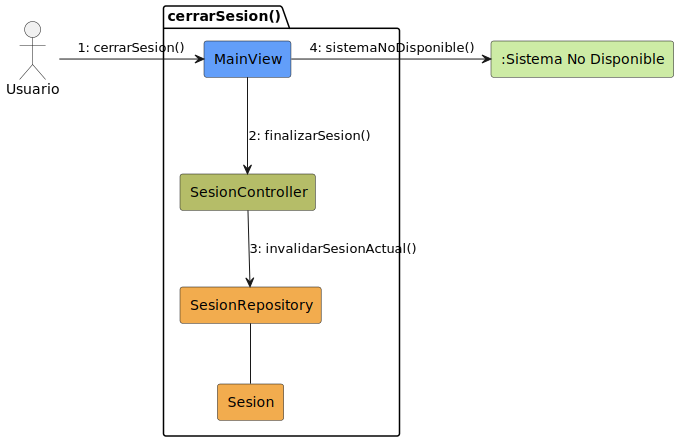
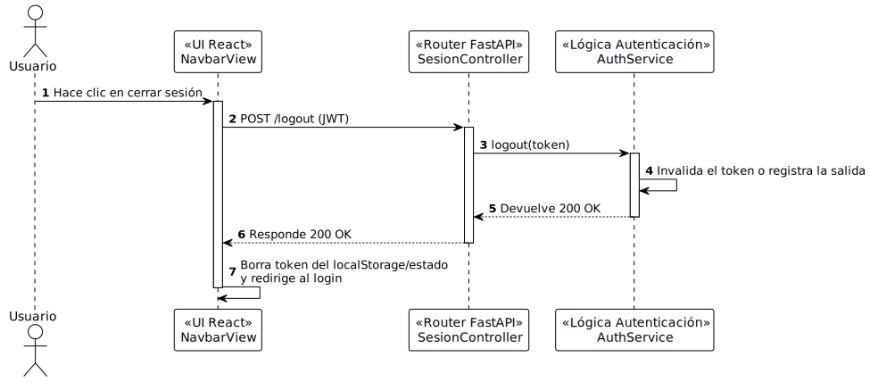

# Diseño Técnico: Caso de Uso - cerrarSesion

> | [🏠 Inicio](/README.md) | [🏗️ Análisis](/RUP/01-analisis/casos-uso/cerrarSesion/README.md) | [🎨 Diseño](/RUP/02-diseño) | [💻 Desarrollo](/frontend/src) |

---

## 1. Diagrama de Colaboración (Análisis RUP)

A nivel de análisis conceptual (BCE), el diagrama de comunicación en formato de grafo modela las interacciones iniciales agnósticas a la tecnología.



* [Código fuente PlantUML (.puml)](../../../01-analisis/casos-uso/cerrarSesion/colaboracion.puml)

---

## 2. Diagrama de Secuencia (Diseño MVC)

A nivel de diseño físico, la realización técnica detalla el flujo de mensajes asíncronos y la orquestación a través del controlador, el servicio y el repositorio.



* [Código fuente PlantUML (.puml)](./secuencia-diseno.puml)

---

## 3. Especificación del Contrato de API (Endpoint)

Para cerrar la sesión, se realiza una petición HTTP POST enviando el token de autenticación.

- **Endpoint:** `POST /api/v1/auth/logout`
- **Content-Type:** `application/json`

### Request Headers
```http
Authorization: Bearer <token_jwt>
```

### Response (Success 200 OK)
```json
{
  "detail": "Sesión cerrada correctamente"
}
```

### Errores Manejados
| Código | Razón | Detalle |
| :--- | :--- | :--- |
| **401** | Unauthorized | Token inválido, expirado o no proporcionado. |
| **500** | Internal Server Error | Error no controlado en el servidor. |

---

## 4. Trazabilidad: Análisis (BCE) a Diseño Técnico

| Componente Análisis | Implementación Física (Diseño) | Responsabilidad |
| :--- | :--- | :--- |
| **PrincipalView** (Boundary) | `NavbarView` (React Component) | UI para invocar la acción de cerrar sesión. |
| **PrincipalView** (Boundary) | `AuthContext.tsx` | Limpieza del estado local y eliminación del token JWT. |
| **PrincipalView** (Boundary) | `auth.service.ts` | Gestión de la invalidación de la sesión en el cliente (petición POST /logout). |
| **SesionController** (Control) | `auth_router.py` (FastAPI Router) | Punto de entrada para operaciones de sesión y manejo del endpoint de logout. |
| **SesionController** (Control) | `AuthService` (Lógica Autenticación) | Lógica de negocio asociada a la invalidación del token. |