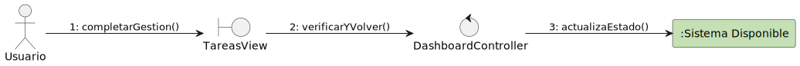
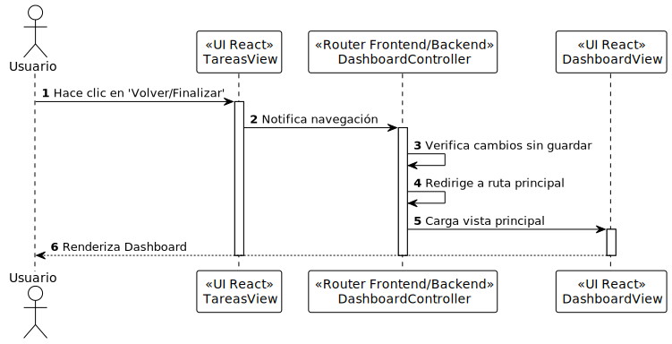

# Diseño Técnico: Caso de Uso - completarGestion

> | [🏠 Inicio](/README.md) | [🏗️ Análisis](/RUP/01-analisis/casos-uso/completarGestion/README.md) | [🎨 Diseño](/RUP/02-diseño) | [💻 Desarrollo](/frontend/src) |

---

## 1. Diagrama de Colaboración (Análisis RUP)

A nivel de análisis conceptual (BCE), el diagrama de comunicación en formato de grafo modela las interacciones iniciales agnósticas a la tecnología.



* [Código fuente PlantUML (.puml)](../../../01-analisis/casos-uso/completarGestion/colaboracion.puml)

---

## 2. Diagrama de Secuencia (Diseño MVC)

A nivel de diseño físico, la realización técnica detalla el flujo de mensajes asíncronos y la orquestación a través del controlador, el servicio y el repositorio.



* [Código fuente PlantUML (.puml)](./secuencia-diseno.puml)

---

## 3. Especificación del Contrato de API (Endpoint)

Este flujo modela la navegación del usuario de vuelta al menú principal o vista del panel de control tras finalizar la gestión de tareas. Al tratarse de una redirección local en el frontend, no requiere endpoints directos en el servidor.

- **Ruta Frontend:** `/dashboard`
- **Mecanismo:** React Router (Redirección programática)

### Estado de la Navegación (Ejemplo de payload del enrutador local)
```json
{
  "pathname": "/dashboard",
  "search": "",
  "hash": "",
  "state": null
}
```

### Manejo de Estados Locales
| Evento | Acción en UI | Detalle |
| :--- | :--- | :--- |
| **Cambios sin guardar** | Diálogo de confirmación | Si el usuario editó tareas y no guardó cambios, se previene la salida y se alerta en pantalla. |
| **Sesión Expirada** | Redirección forzada | Si el token JWT expira durante la navegación, el enrutador redirige automáticamente a `/login`. |

---

## 4. Trazabilidad: Análisis (BCE) a Diseño Técnico

| Componente Análisis | Implementación Física (Diseño) | Responsabilidad |
| :--- | :--- | :--- |
| **TareasView** (Boundary) | `TareasView` (React Component) | Interfaz que contiene el botón "Volver/Finalizar" para completar la gestión de tareas. |
| **DashboardController** (Control) | `Router Frontend/Backend` | Manejador de rutas en React que verifica cambios pendientes y redirige. |
| **DashboardView** (Boundary) | `DashboardView` (React Component) | Vista principal del menú a la que es redirigido el usuario. |