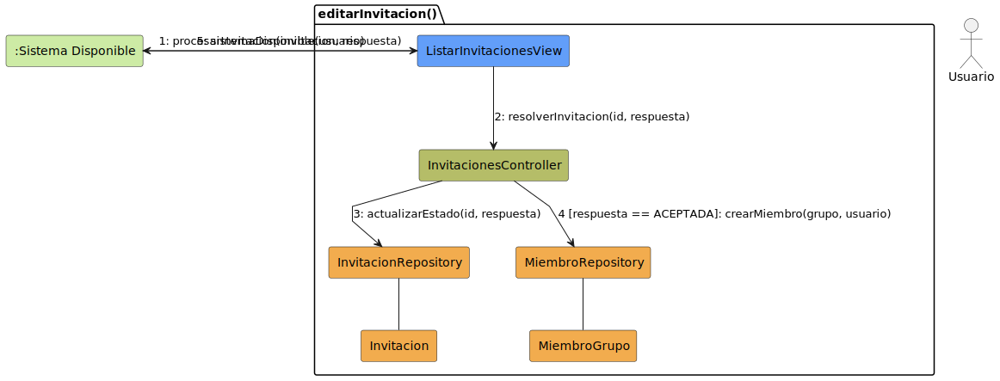
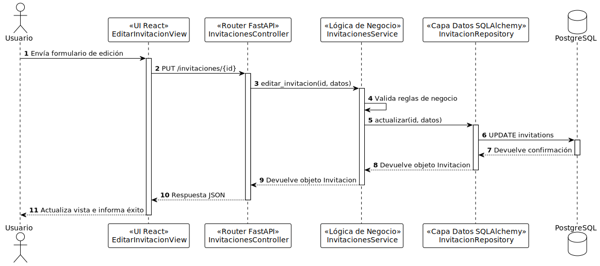

# Diseño Técnico: Caso de Uso - editarInvitacion

> | [🏠 Inicio](/README.md) | [🏗️ Análisis](/RUP/01-analisis/casos-uso/editarInvitacion/README.md) | [🎨 Diseño](/RUP/02-diseño) | [💻 Desarrollo](/frontend/src) |

---

## 1. Diagrama de Colaboración (Análisis RUP)

A nivel de análisis conceptual (BCE), el diagrama de comunicación en formato de grafo modela las interacciones iniciales agnósticas a la tecnología.



* [Código fuente PlantUML (.puml)](../../../01-analisis/casos-uso/editarInvitacion/colaboracion.puml)

---

## 2. Diagrama de Secuencia (Diseño MVC)

A nivel de diseño físico, la realización técnica detalla el flujo de mensajes asíncronos y la orquestación a través del controlador, el servicio y el repositorio.



* [Código fuente PlantUML (.puml)](./secuencia.puml)

---

## 3. Especificación del Contrato de API (Endpoint)

Para modificar el estado de una invitación (por ejemplo: aceptarla o rechazarla) aplicando validación de reglas de negocio en la capa de servicio.

- **Endpoint:** `PUT /api/v1/invitaciones/{id}`
- **Content-Type:** `application/json`

### Request Headers
```http
Authorization: Bearer <token_jwt>
```

### Request Body
```json
{
  "estado": "aceptada"
}
```

### Response (Success 200 OK)
```json
{
  "id": 1,
  "grupo_id": 3,
  "remitente_id": 10,
  "estado": "aceptada"
}
```

### Errores Manejados
| Código | Razón | Detalle |
| :--- | :--- | :--- |
| **401** | Unauthorized | Token inválido o ausente. |
| **404** | Not Found | La invitación con el ID especificado no existe. |
| **422** | Unprocessable Entity | Estado inválido o error de validación en la estructura de los datos. |
| **500** | Internal Server Error | Error no controlado en la base de datos o servidor. |

---

## 4. Trazabilidad: Análisis (BCE) a Diseño Técnico

| Componente Análisis | Implementación Física (Diseño) | Responsabilidad |
| :--- | :--- | :--- |
| **EditarInvitacionView** (Boundary) | `EditarInvitacionView` (React Component) | Interfaz de usuario para editar una invitación y enviar la petición HTTP PUT. |
| **EditarInvitacionView** (Boundary) | `api/invitaciones.service.ts` (Axios) | Realización de la petición HTTP PUT `/invitaciones/{id}`. |
| **InvitacionesController** (Control) | `invitaciones_controller.py` (FastAPI Router) | Endpoint `PUT /invitaciones/{id}` para recibir la petición y delegar al servicio. |
| **InvitacionesService** (Control) | `invitaciones_service.py` | Lógica de negocio: validación y delegación al repositorio. |
| **InvitacionRepository** (Entity Abstr.) | `invitacion_repository.py` | Persistencia en base de datos PostgreSQL mediante SQLAlchemy con `actualizar`. |
| **EntidadInvitacion** (Entity) | `models/invitation.py` (SQLAlchemy Model) | Definición estructural de los datos de la invitación. |
