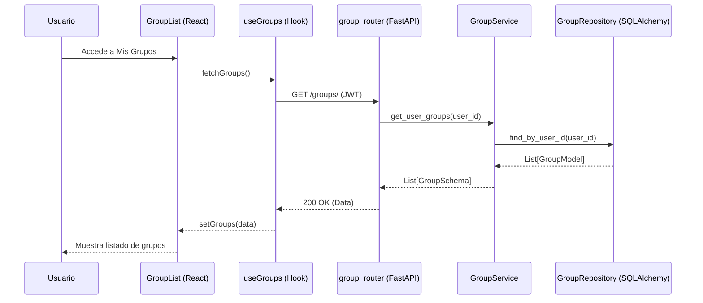

# Diseño Técnico: abrirGrupos

> |[🏠️](/RUP/README.md)|Análisis|[Diseño](/RUP/02-diseño/README.md)|Desarrollo|Pruebas|
> |-|-|-|-|-|

## Información del Artefacto
- **Módulo**: Gestión de Grupos
- **Caso de Uso**: abrirGrupos
- **Arquitectura**: React (Frontend) + FastAPI (Backend)
- **Patrón**: Capas / SoC

## Descripción
Este caso de uso permite al usuario visualizar el listado de todos los grupos a los que pertenece actualmente. La información se obtiene de forma asíncrona al cargar el dashboard o la sección de grupos.

## Actores
- **Usuario Autenticado**: Cualquier usuario con una sesión válida.

## Precondiciones
- El usuario debe tener un token JWT válido.

## Flujo Principal
1. El usuario accede a la sección de "Mis Grupos" en el Frontend.
2. El componente de React (`GroupList`) utiliza un Hook personalizado (`useGroups`) para solicitar los datos.
3. El Hook realiza una petición `GET /groups/` incluyendo el JWT en la cabecera.
4. El Backend (`group_router`) recibe la petición y valida el token.
5. El `GroupService` consulta al `GroupRepository` los grupos vinculados al ID del usuario.
6. El Backend responde con un `200 OK` y un listado de objetos `GroupSchema`.
7. El Frontend renderiza la lista de tarjetas de grupo.

## Reglas de Negocio
- **RN-GRU-01**: Solo se deben mostrar los grupos donde el usuario tiene un registro activo en la tabla de miembros.
- **RN-GRU-02**: Si el usuario no pertenece a ningún grupo, se debe mostrar un estado vacío (Empty State) informativo.

## Postcondiciones
- El usuario visualiza sus grupos activos.

## Diagrama de Secuencia (Mermaid)

