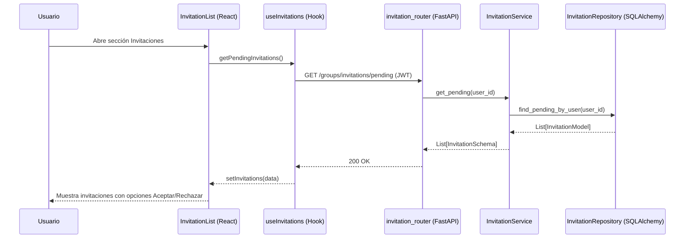

# Diseño Técnico: abrirInvitaciones

> |[🏠️](/RUP/README.md)|Análisis|[Diseño](/RUP/02-diseño/README.md)|Desarrollo|Pruebas|
> |-|-|-|-|-|

## Información del Artefacto
- **Módulo**: Gestión de Grupos
- **Caso de Uso**: abrirInvitaciones
- **Arquitectura**: React (Frontend) + FastAPI (Backend)

## Descripción
Permite al usuario visualizar las invitaciones pendientes que ha recibido para unirse a diferentes grupos. Es un paso previo a la aceptación o rechazo de las mismas.

## Actores
- **Usuario Autenticado**: El receptor de las invitaciones.

## Precondiciones
- Sesión activa con token JWT.

## Flujo Principal
1. El usuario navega a la sección de "Invitaciones Pendientes".
2. El componente `InvitationList` invoca al hook `useInvitations`.
3. Se envía una petición `GET /groups/invitations/pending`.
4. El Router de FastAPI valida el usuario y delega al `InvitationService`.
5. Se filtran las invitaciones en estado `PENDING` para el correo o ID del usuario.
6. Se retorna el listado y el Frontend lo renderiza.

## Reglas de Negocio
- **RN-INV-01**: Solo se muestran invitaciones con estatus `PENDING`.
- **RN-INV-02**: La invitación debe estar asociada inequívocamente al identificador del usuario (email o ID).

## Diagrama de Secuencia (Mermaid)

