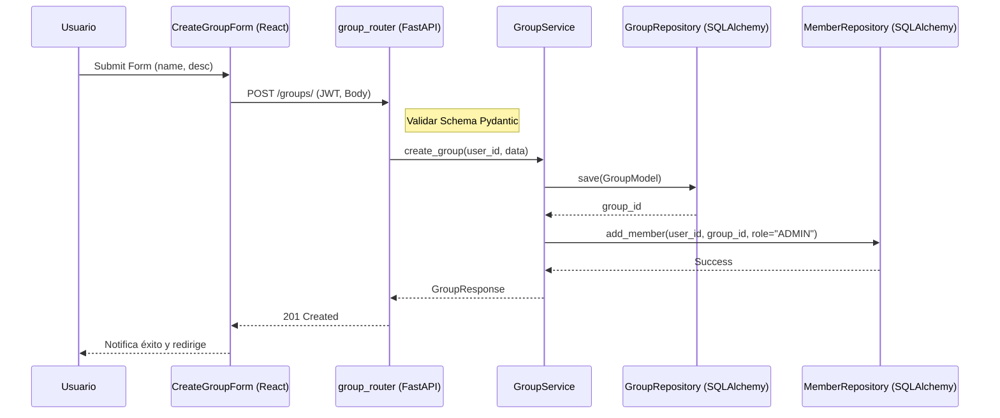

# Diseño Técnico: crearGrupo

> | [🏠 Inicio](/README.md) | [🏗️ Análisis](/RUP/01-analisis) | [🎨 Diseño](/RUP/02-diseño) | [💻 Desarrollo](/frontend/src) |

## Información del Artefacto
- **Módulo**: Gestión de Grupos
- **Caso de Uso**: crearGrupo
- **Arquitectura**: React + FastAPI + SQLAlchemy

## Descripción
Permite la creación de un nuevo grupo. El sistema debe garantizar que el usuario que lo crea quede automáticamente registrado como el administrador del grupo (ADMIN).

## Actores
- **Usuario Autenticado**

## Precondiciones
- Token JWT válido.

## Flujo Principal
1. El usuario completa el formulario de creación (Nombre, Descripción).
2. Se envía una petición `POST /groups/` con el `GroupCreateSchema`.
3. El Backend valida los datos (Pydantic).
4. El `GroupService` inicia una transacción de base de datos.
5. Se crea la entidad `Grupo`.
6. Se crea la entidad `MiembroGrupo` vinculando al `user_id` con el `grupo_id` y asignando el rol `ADMIN`.
7. Se confirma la transacción.
8. Se retorna el grupo creado.

## Reglas de Negocio
- **RN-GRU-03**: El nombre del grupo es obligatorio.
- **RN-GRU-04**: Un usuario puede crear múltiples grupos.
- **RN-GRU-05**: La asignación del rol de administrador debe ser atómica a la creación del grupo.

## Diagrama de Secuencia (Mermaid)

