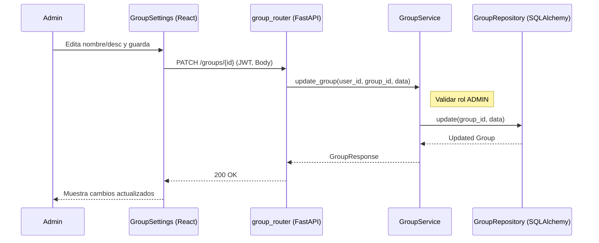

# Diseño Técnico: editarGrupo

> |[🏠️](/RUP/README.md)|Análisis|[Diseño](/RUP/02-diseño/README.md)|Desarrollo|Pruebas|
> |-|-|-|-|-|

## Información del Artefacto
- **Módulo**: Gestión de Grupos
- **Caso de Uso**: editarGrupo
- **Arquitectura**: React + FastAPI

## Descripción
Permite a un administrador modificar la información básica de un grupo (nombre, descripción).

## Actores
- **Administrador del Grupo (ADMIN)**

## Precondiciones
- El usuario debe tener el rol `ADMIN` en el grupo objetivo.
- Token JWT válido.

## Flujo Principal
1. El administrador accede a la configuración del grupo.
2. Modifica los campos deseados y pulsa "Guardar".
3. Se envía `PATCH /groups/{group_id}`.
4. El Backend verifica que el usuario sea `ADMIN` del grupo.
5. Se actualiza el registro en la base de datos.
6. Se retorna el objeto actualizado.

## Reglas de Negocio
- **RN-GRU-06**: Solo un usuario con rol `ADMIN` puede editar la información del grupo.
- **RN-GRU-07**: No se puede cambiar el ID del grupo.

## Diagrama de Secuencia (Mermaid)

