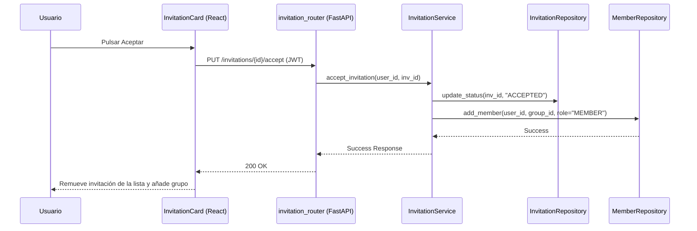

# Diseño Técnico: editarInvitacion

> | [🏠 Inicio](/README.md) | [🏗️ Análisis](/RUP/01-analisis) | [🎨 Diseño](/RUP/02-diseño) | [💻 Desarrollo](/frontend/src) |

## Información del Artefacto
- **Módulo**: Gestión de Grupos
- **Caso de Uso**: editarInvitacion (Aceptar/Rechazar)
- **Arquitectura**: React + FastAPI + SQLAlchemy

## Descripción
Este caso de uso cubre la respuesta del usuario a una invitación. Si la acepta, se convierte en miembro del grupo. Si la rechaza, la invitación cambia de estado y se cierra el flujo.

## Actores
- **Usuario Invitado**

## Precondiciones
- Existencia de una invitación con estado `PENDING` dirigida al usuario.

## Flujo Principal (Aceptar)
1. El usuario pulsa "Aceptar" en la lista de invitaciones.
2. Se envía `PUT /groups/invitations/{id}/accept`.
3. El Backend valida la invitación.
4. Se cambia el estado de la invitación a `ACCEPTED`.
5. Se crea un registro en `MiembroGrupo` con rol `MEMBER` por defecto.
6. Se confirma la operación.

## Reglas de Negocio
- **RN-INV-03**: Al aceptar una invitación, el usuario se une automáticamente al grupo con el rol de `MEMBER`.
- **RN-INV-04**: Una invitación rechazada no puede ser aceptada posteriormente.

## Diagrama de Secuencia (Mermaid)

