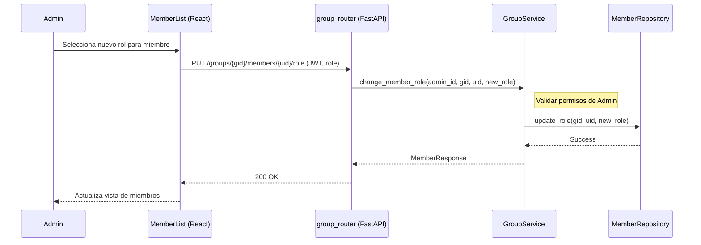

# Diseño Técnico: editarMiembro

> |[🏠️](/RUP/README.md)|Análisis|[Diseño](/RUP/02-diseño/README.md)|Desarrollo|Pruebas|
> |-|-|-|-|-|

## Información del Artefacto
- **Módulo**: Gestión de Grupos
- **Caso de Uso**: editarMiembro (Cambio de Rol)
- **Arquitectura**: React + FastAPI

## Descripción
Permite a un administrador del grupo cambiar el rol de otro miembro (ej. promover a un Miembro a Miembro Administrador).

## Actores
- **Administrador del Grupo (ADMIN)**

## Precondiciones
- El actor debe ser `ADMIN` del grupo.
- El objetivo debe ser un miembro activo del grupo.

## Flujo Principal
1. El ADMIN selecciona un miembro en la lista de integrantes.
2. Cambia su rol (ej. de MEMBER a ADMIN_MEMBER).
3. Se envía `PUT /groups/{id}/members/{user_id}/role`.
4. El Backend valida jerarquías y permisos.
5. Se actualiza el campo `role` en la tabla `MiembroGrupo`.

## Reglas de Negocio
- **RN-MEM-01**: Solo un `ADMIN` puede promover a otros usuarios.
- **RN-MEM-02**: Un `ADMIN_MEMBER` tiene permisos limitados (ej. no puede eliminar el grupo o cambiar el rol de otros admins).

## Diagrama de Secuencia (Mermaid)

