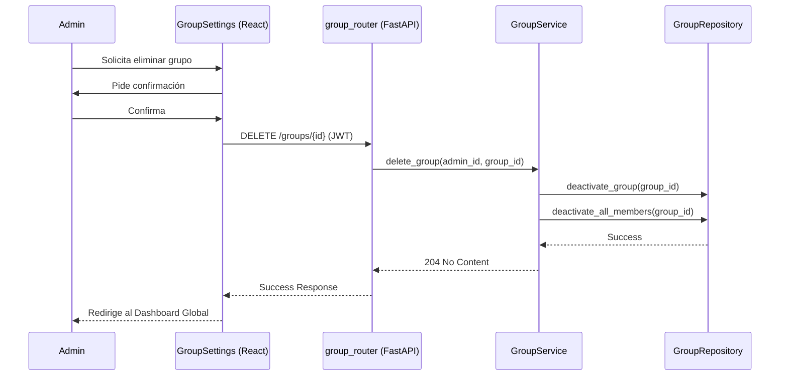

# Diseño Técnico: eliminarGrupo

> | [🏠 Inicio](/README.md) | [🏗️ Análisis](/RUP/01-analisis) | [🎨 Diseño](/RUP/02-diseño) | [💻 Desarrollo](/frontend/src) |

## Información del Artefacto
- **Módulo**: Gestión de Grupos
- **Caso de Uso**: eliminarGrupo
- **Arquitectura**: React + FastAPI + SQLAlchemy

## Descripción
Permite la eliminación de un grupo. Por razones de integridad de datos, se recomienda un **borrado lógico** (`is_active = False`) que desvincule a todos los miembros y oculte las tareas, permitiendo una posible auditoría o recuperación futura.

## Actores
- **Administrador del Grupo (ADMIN)**

## Precondiciones
- El usuario debe ser el `ADMIN` principal del grupo.
- Token JWT válido.

## Flujo Principal
1. El ADMIN solicita la eliminación del grupo desde el panel de control.
2. El sistema pide una confirmación explícita.
3. Se envía `DELETE /groups/{id}`.
4. El Backend verifica permisos.
5. El `GroupService` marca el grupo como inactivo y realiza un "cascade" lógico sobre las membresías.
6. Se retorna éxito.

## Reglas de Negocio
- **RN-GRU-08**: Solo el creador original o un usuario con rol `ADMIN` global puede eliminar un grupo.
- **RN-GRU-09**: Al eliminar un grupo, todas sus tareas asociadas deben quedar inaccesibles.

## Diagrama de Secuencia (Mermaid)

