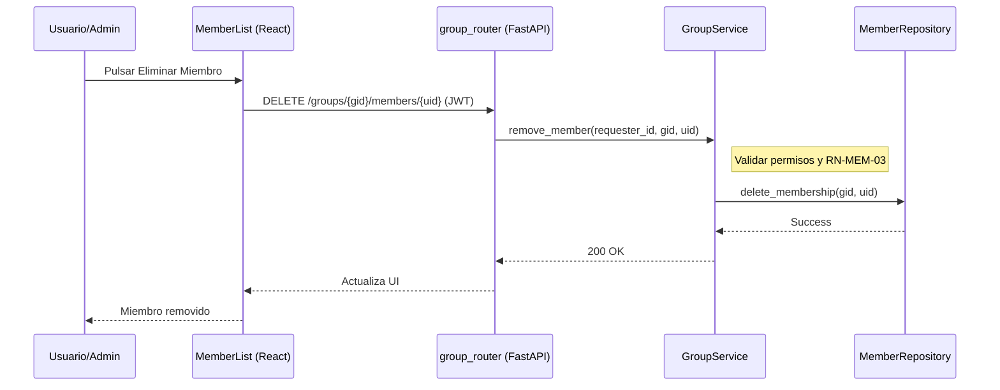

# Diseño Técnico: eliminarMiembro

> |[🏠️](/RUP/README.md)|Análisis|[Diseño](/RUP/02-diseño/README.md)|Desarrollo|Pruebas|
> |-|-|-|-|-|

## Información del Artefacto
- **Módulo**: Gestión de Grupos
- **Caso de Uso**: eliminarMiembro (Expulsar o Salir)
- **Arquitectura**: React + FastAPI

## Descripción
Cubre dos situaciones: un administrador expulsando a un miembro, o un miembro decidiendo abandonar el grupo por voluntad propia.

## Actores
- **Administrador del Grupo** (Expulsión)
- **Cualquier Miembro** (Abandono voluntario)

## Precondiciones
- El usuario objetivo debe pertenecer al grupo.

## Flujo Principal (Expulsión)
1. El ADMIN pulsa "Eliminar" junto al nombre de un miembro.
2. Se envía `DELETE /groups/{gid}/members/{uid}`.
3. El Backend valida que el solicitante tenga permisos y que no esté intentando eliminarse a sí mismo si es el único admin.
4. Se elimina el registro de `MiembroGrupo`.

## Reglas de Negocio
- **RN-MEM-03**: Un grupo no puede quedar sin administradores. Si el último admin desea salir, debe promover a otro o eliminar el grupo.
- **RN-MEM-04**: Un `MEMBER` solo puede eliminarse a sí mismo.

## Diagrama de Secuencia (Mermaid)

