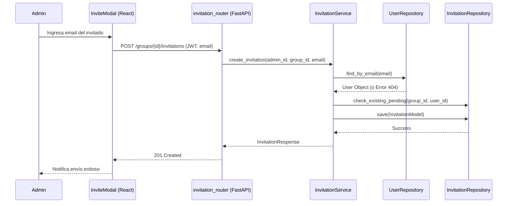

# Diseño Técnico: invitarUsuario

> |[🏠️](/RUP/README.md)|Análisis|[Diseño](/RUP/02-diseño/README.md)|Desarrollo|Pruebas|
> |-|-|-|-|-|

## Información del Artefacto
- **Módulo**: Gestión de Grupos
- **Caso de Uso**: invitarUsuario
- **Arquitectura**: React + FastAPI

## Descripción
Permite a un administrador enviar una invitación a un usuario externo mediante su identificador (email o username). La invitación queda en espera de ser aceptada.

## Actores
- **Administrador del Grupo (ADMIN/ADMIN_MEMBER)**

## Precondiciones
- El actor debe tener permisos de gestión en el grupo.

## Flujo Principal
1. El administrador ingresa el identificador del invitado.
2. Se envía `POST /groups/{id}/invitations`.
3. El Backend valida que el invitado exista en el sistema.
4. El Backend valida que el invitado no sea ya miembro del grupo.
5. Se crea un registro en `Invitacion` con estado `PENDING`.

## Reglas de Negocio
- **RN-INV-05**: No se pueden enviar múltiples invitaciones pendientes al mismo usuario para el mismo grupo.
- **RN-INV-06**: El usuario invitado debe estar previamente registrado en la plataforma.

## Diagrama de Secuencia (Mermaid)

