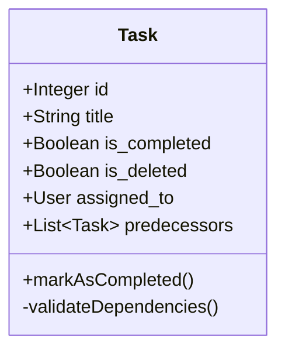

# Diseño de Caso de Uso: marcarCompletada

## 1. Descripción
Este caso de uso permite a un usuario autorizado marcar una tarea como finalizada, cambiando su estado a completado.

## 2. Reglas de Negocio (Business Rules)
- **BR-MC-01 (Permisos):** Solo el usuario asignado a la tarea, un Administrador o un Miembro Administrador del mismo grupo pueden completar la tarea.
- **BR-MC-02 (Condición de Guarda - Dependencias):** Una tarea NO puede marcarse como completada si tiene tareas previas (`predecessors`) que aún están pendientes (`is_completed == False`) y que no han sido eliminadas (`is_deleted == False`).
- **BR-MC-03 (Estado Inmutable):** Una tarea ya completada no puede volver a marcarse como pendiente sin una acción explícita de "reabrir" (fuera del alcance de este CU).

## 3. Atributos de Clase Relacionados
- `Task.is_completed: Boolean` (Default: False)
- `Task.completed_at: DateTime` (Opcional, para auditoría)

## 4. Diagrama de Clases (Conceptual)

## 5. Flujo Lógico de Validación
1. El sistema verifica los permisos del usuario actual.
2. El sistema consulta todas las tareas en la relación `predecessors` de la tarea actual.
3. Si existe alguna tarea donde `is_completed == False` Y `is_deleted == False`, el sistema lanza una excepción `DependencyViolationError`.
4. Si todas están completadas o eliminadas, se actualiza `is_completed = True`.
