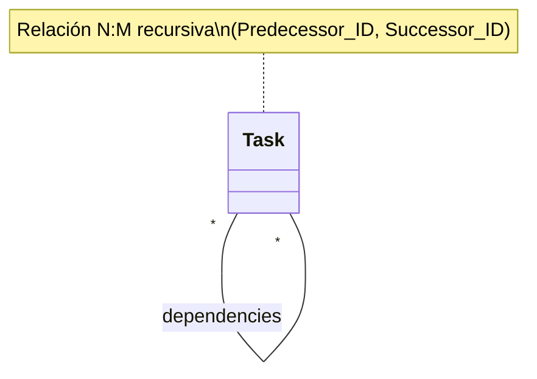

# Diseño de Caso de Uso: relacionarTareas

## 1. Descripción
Permite establecer una relación de dependencia entre dos tareas, donde una tarea debe completarse antes que la otra (Relación Predecesor-Sucesor).

## 2. Reglas de Negocio (Business Rules)
- **BR-RT-01 (Tipo de Relación):** Relación recursiva N:M sobre la entidad `Task`. Una tarea puede tener múltiples predecesores y múltiples sucesores.
- **BR-RT-02 (Semántica):** La relación se define como "Tarea A bloquea a Tarea B" o "Tarea B depende de Tarea A".
- **BR-RT-03 (Restricción de Estado):** No se pueden crear relaciones de dependencia si la tarea sucesora ya está completada.

## 3. Estructura de Clases
Se requiere una tabla asociativa o una relación autorreferenciada en el ORM.

### Atributos:
- `Task.predecessors`: Colección de tareas que deben terminar antes.
- `Task.successors`: Colección de tareas que dependen de la actual.

## 4. Representación UML (Estructura)

## 5. Integridad de Datos
- Si se intenta relacionar una tarea consigo misma, el sistema debe rechazarlo (Auto-dependencia).
- Cada nueva relación debe invocar el caso de uso `validarConflicto`.
