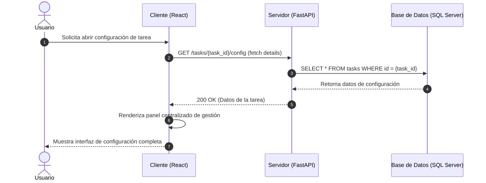

# Análisis de Colaboración: abrirPlanificacion()

## Propósito
Análisis de colaboración del caso de uso abrirPlanificacion() para visualizar y gestionar de forma centralizada todos los parámetros de configuración de una tarea (horario, localización, recordatorios y asignación).

## Diagrama de Secuencia (Mermaid)

