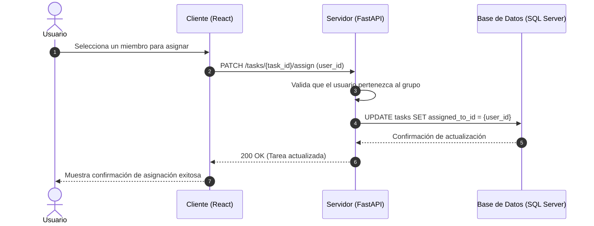

# Análisis de Colaboración: asignarTareaAUsuario()

## Propósito
Análisis de colaboración del caso de uso asignarTareaAUsuario() para vincular formalmente a un miembro del grupo con una tarea específica, definiendo la responsabilidad de ejecución.

## Diagrama de Secuencia (Mermaid)

