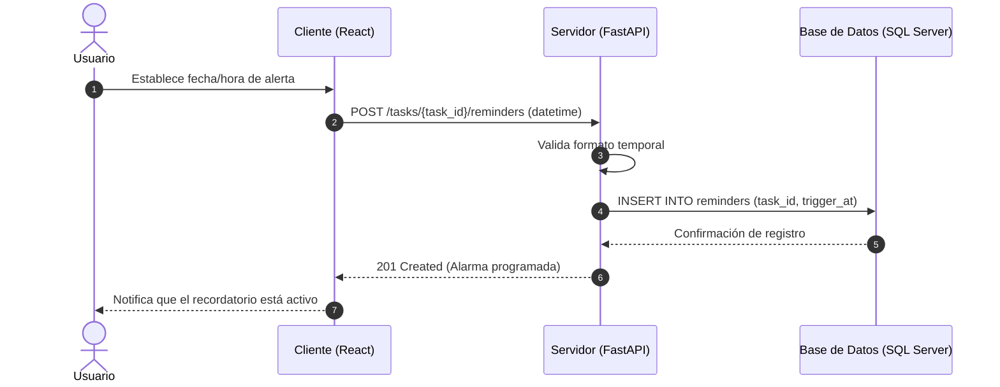

# Análisis de Colaboración: configurarRecordatorio()

## Propósito
Análisis de colaboración del caso de uso configurarRecordatorio() para permitir la programación de alertas y notificaciones asociadas a una tarea, mejorando el seguimiento y cumplimiento de actividades.

## Diagrama de Secuencia (Mermaid)

