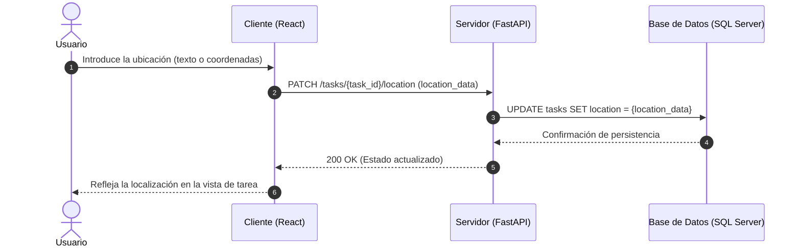

# Análisis de Colaboración: definirLocalizacion()

## Propósito
Análisis de colaboración del caso de uso definirLocalizacion() para especificar el lugar físico o virtual donde se desarrollará la tarea, permitiendo una mejor coordinación logística familiar.

## Diagrama de Secuencia (Mermaid)

