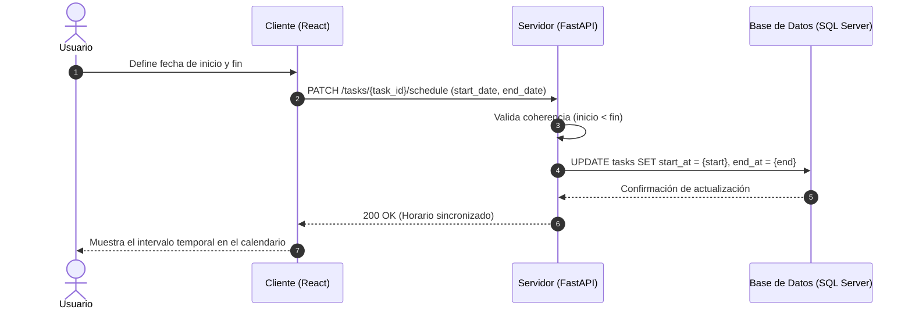

# Análisis de Colaboración: establecerHorario()

## Propósito
Análisis de colaboración del caso de uso establecerHorario() para definir los parámetros temporales de una tarea, garantizando que el cronograma familiar esté actualizado y sincronizado.

## Diagrama de Secuencia (Mermaid)

